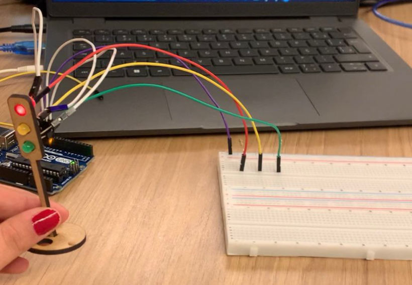

## Montagem Física:

&nbsp;&nbsp;&nbsp;&nbsp; Na imagem abaixo, está representada a atividade realizada em sala, que tinha como objetivo a construção de um semáforo utilizando LEDs e resistores em uma protoboard.

Figura 1 - montagem física - protoboard com LEDs conectados.
 

 
Fonte: Material produzido pelo grupo Apontados (2024)

&nbsp;&nbsp;&nbsp;&nbsp; Para a montagem física, foram utilizados jumpers, conectados ao terminal positivo de cada LED (sendo cada jumper da cor correspondente ao LED) e à protoboard. Os outros jumpers (brancos) foram conectados ao terminal negativo dos LEDs e às portas 11, 12 e 13 do Arduino, como será mostrado no código mais adiante. Em seguida, o jumper roxo foi conectado do GND ao terra. Também, foi colocado os resistores em série com cada LED para limitar a corrente. Por fim, conectei o Arduino ao computador para carregar o código.

&nbsp;&nbsp;&nbsp;&nbsp; No quadro abaixo, é possível visualizar todos os materiais usados na montagem física: 

| Material                | Quantidade |
|-------------------------|------------|
| LED Verde               | 1          |
| LED Amarelo             | 1          |
| LED Vermelho            | 1          |
| Jumpers                 | 7          |
| Resistor de 220Ω        | 3          |
| Protoboard              | 1          |
| Arduino Uno             | 1          |
| Cabo USB para Arduino   | 1          |

## Programação e Lógica do Semáforo

&nbsp;&nbsp;&nbsp;&nbsp; A imagem a seguir mostra o código utilizado para fazer os LEDs do semáforo piscarem conforme o proposto na atividade.

Figura 2 - Código usado na atividade.
 

 
Fonte: Material produzido pelo grupo Apontados (2024)

## Vídeo - Funcionamento do Semáforo

&nbsp;&nbsp;&nbsp;&nbsp; No link a seguir, encontra-se o vídeo da montagem física e do código em funcionamento, mostrando o semáforo operando conforme o esperado.

 [semaforo-com-arduino](https://drive.google.com/file/d/18-EzVYL5rUXImuxmGBbYsKe2eS7sGtXw/view?usp=drivesdk)
